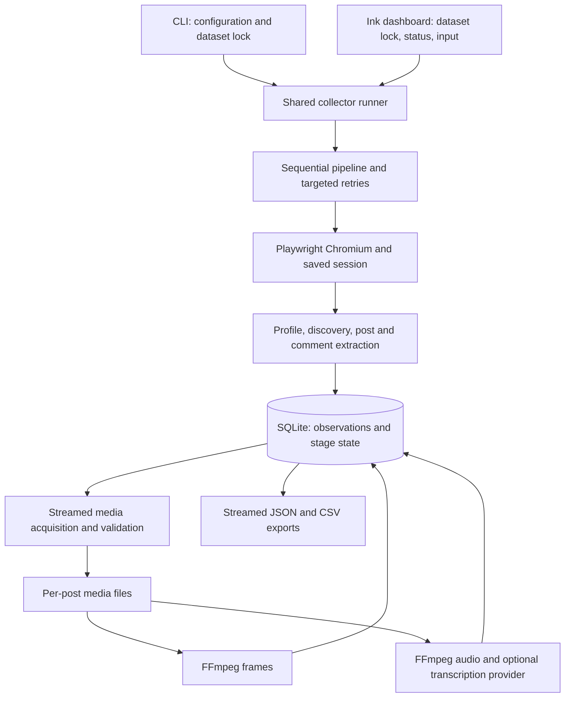

# Production review and operating guide

Reviewed 2026-09-22. Scope: reliable local collection of thousands of posts across many competitors. The existing CLI, SQLite, and sequential browser architecture have been retained.

**Assessment:** the collector has useful recovery and integrity protections after this review. Use it as a supervised collector with a live canary before a large run. Local fixtures establish recovery behavior; they cannot establish that today's Instagram layout exposes every post or comment. A successful exit is not a guarantee of a complete historical inventory.

## Concrete weaknesses fixed

| Priority | Problem | Change |
| --- | --- | --- |
| High | Two CLI processes could update the same post files and job state concurrently. Killed jobs remained running. | A SQLite lock serializes commands for each dataset and releases on process death. Startup marks abandoned jobs interrupted while retaining stage progress. |
| High | WAL commits could be lost on power failure; migration checks could race. | Explicit `synchronous=FULL`, 5-second database busy timeout, and migration checks inside immediate transactions. |
| High | A full disk or locked database could be treated as thousands of independent post failures. | Storage errors escape item, stage, and competitor retry loops. Good media is not quarantined because a later database update failed. |
| High | Discovery could declare success using old database rows and a missing-post tolerance; rounded counts could conceal omissions. | Count-based completion requires unique posts seen in this walk and an exact JSON count, with no tolerance. Access checks run every round. |
| High | Profile response capture kept retaining JSON while discovery scrolled. Pending response bodies could wait indefinitely. | Detach the profile listener when capture ends, bound response waits, and dispose avatar API responses. |
| High | Exports loaded a competitor's raw payloads and comments into memory; grouping repeatedly copied growing arrays. | Stream one post and its related rows at a time; append to groups in place. A 2,000-post/60,000-comment regression runs with a 96 MiB JavaScript heap. |
| High | Comment reply pagination could terminate the top-level thread; duplicates consumed a raised limit; empty/limited results could claim completion. | Separate top-level completion evidence, apply caps to new inserts, deduplicate JSON/DOM overlap, and preserve partial/count-mismatch outcomes. HTTP error pages fail collection. |
| High | CSV text could execute as spreadsheet formulas; dot-only usernames could escape intended folders; reused session temporary files could retain loose permissions. | Escape formula-like CSV strings, reject dot-only usernames, enforce session permissions, and use a restrictive CLI umask. JSON preserves original text. |
| Medium | Browser crashes could spend retries across the backlog; a signal during Chromium launch could leave the browser open. | Treat browser closure/crash as a batch stop; closing the manager awaits an outstanding launch. |
| Medium | A degraded profile refresh could replace exact counts and content with rounded or missing values. | Preserve existing latest values for DOM/meta-only refreshes while retaining the new raw observation. |
| Medium | Missing/corrupt completed media could remain complete at the retry cap; refresh summaries counted affected posts instead of failed files. | Validate size and format before reuse, return damaged/missing files to pending, validate adopted file types, and report refreshed failures accurately. |
| Medium | Downloads could retain large response buffers or follow unvalidated redirects. | Bound error-body reads, cancel response bodies, reject redirects/oversized declared bodies, and propagate cancellation through streaming writes. Flush the destination directory after media renames on Unix. |
| Medium | Authentication failures during media URL refresh did not consistently stop later browser stages. | Carry the blocked state through the pipeline and retries. Skip metadata/comments when the latest profile is private or unavailable. |
| Medium | Completed frames could consume a limited run before unfinished Reels. Very short Reels produced no frame. | Select unfinished work first and use FFmpeg FPS rounding that preserves a frame for short videos. |
| Medium | Transcription authentication, throttling, and service errors could fail every remaining Reel. Missing FFmpeg was detected per item. | Stop the transcript stage on HTTP 401/403/429/5xx without spending post attempts; preflight FFmpeg. Check upload size before reading audio into memory and validate segment times. |
| Medium | Some aborts/retries returned success; collaboration posts had inconsistent status counts; routine query indexes were missing. | Preserve exit 130 for interruption, report unresolved retry failures, count collaboration links, and add migration 014 indexes. |
| Medium | Console errors could expose API keys, signed URL parameters, or terminal control characters. | Redact configured keys, URL credentials/query strings, and controls. Ignore additional `.env.*` files. |

The collector architecture and existing numbered migrations were left intact. The dashboard adds Ink, React, and a separate migration for archived competitors.

### Verification

- `npm test`: **80 passed**, none skipped. Includes fresh-schema migration, legacy upgrade, dashboard input/settings/path checks, missing-folder recovery, duplicate prevention, retry caps, media corruption/interruption, session permissions, lock release after SIGKILL, disk-error injection, export scaling, and real Chromium/FFmpeg checks.
- `npm run typecheck`, `npm run lint`, and `npm run build`: passed.
- Additional CLI smoke checks passed: repeated init/import, status/help, missing-FFmpeg preflight, real Chromium restart after closure, and repeated shutdown. The dashboard reached its first-run and Home screens in a temporary dataset; its add flow passed an Ink interaction test. Verification ran on Node 25.3.0; the declared minimum remains Node 22.13.
- `npm run validate:e2e`: **43/43 checks passed across 17 subsystems and 20 CLI runs**, using local Instagram/CDN/transcription fixtures. Includes SIGINT and SIGKILL recovery, login/challenge failures, rerun idempotency, force refresh, retries, and exports.
- Scale fixture: 2,000 posts with 32 KiB raw payloads each and 60,000 comments; export completed with a 96 MiB JavaScript heap. Peak process RSS was about **320 MiB**, including native allocations. This measures export, not the memory of a long Chromium session.
- `npm audit --json`: zero reported dependency vulnerabilities at review time.
- Migration 014 was applied to a backup copy, rerun as a no-op, then applied to the working dataset during the earlier review. All **157 existing posts** remained; `PRAGMA integrity_check` returned `ok` and `foreign_key_check` returned no rows on both databases. Migration 015 was verified on fresh and upgraded temporary datasets; it was not applied to the working dataset in this dashboard pass.
- On a temporary fixture with 1,000 competitors and 2,000 posts, the status query fell from roughly 397–493 ms to 6–12 ms after changing its aggregation. Ink's Home render measured a median 6.49 ms and p95 15.77 ms. SQLite was the measured bottleneck, so the Node dashboard remains in-process.
- No live Instagram collection or paid transcription call was made. Power loss and a physically full disk were not induced; process death and injected storage failures were tested.

## 1. Architecture summary



- `cli.ts` parses commands and owns CLI shutdown. `app/main.tsx` starts the dashboard and holds the dataset lock; `app/useCollector.ts` handles UI polling and actions. Both front ends call `runner.ts` for browser collection, retries, and exports.
- `pipeline.ts` composes the existing stage implementations. `batch.ts` handles status and targeted retries. Competitors and posts are processed sequentially.
- `browser.ts` owns Chromium; `instagram-session.ts` handles manual login, saved cookies/local storage, and access checks. Browser extraction stays separate from local media processing and provider calls.
- `profile-extract.ts` and `post-extract.ts` prefer matching Instagram JSON, then structural DOM and metadata fallbacks. Source snapshots preserve what was observed.
- SQLite is the source of truth for provenance and progress. Media, captions, and metadata sidecars use stable post folders. A collaboration post has one primary storage location and multiple competitor links.
- Local stages can run without a browser. Media/reels need a browser only for explicit URL refresh; transcripts send audio to the configured provider.

## 2. Current command list

Run CLI commands with `npm run cli -- <command>` after `npm run build`, or `npm run dev -- <command>` to compile first. `npm start` or `npm run app` opens the terminal dashboard. Below, TARGET means one or more registered usernames, or `--all`.

| CLI command | Options / purpose | npm alias |
| --- | --- | --- |
| `help` / `--help` | Current usage | `npm run cli -- help` |
| `init` | Create directories and migrate SQLite | `npm run dev -- init` |
| `competitors-import` | Merge `competitors.txt`; never remove stored competitors | `npm run competitors:import` |
| `competitors-list` | Profile status and counts | `npm run competitors:list` |
| `status` | Dataset progress per competitor | `npm run status` |
| `instagram-login` | Manual login in a headed browser | `npm run instagram:login` |
| `instagram-status` | Validate saved session | `npm run cli -- instagram-status` |
| `scrape-profile TARGET` | Refresh profile observations | `npm run scrape:profile -- TARGET` |
| `discover TARGET` | `--full` to walk beyond the incremental stopping rule | `npm run discover -- TARGET` |
| `scrape-posts TARGET` | `--resume --force --limit N` | `npm run scrape:posts -- TARGET` |
| `media TARGET` | `--limit N --refresh-expired` | `npm run media -- TARGET` |
| `reels TARGET` | `--limit N --refresh` | `npm run reels -- TARGET` |
| `frames TARGET` | `--frame-interval SECONDS --max-frames N --force --limit N` | `npm run process:frames -- TARGET` |
| `transcripts TARGET` | `--force`; configured provider required | `npm run process:transcripts -- TARGET` |
| `scrape-comments TARGET` | `--limit N\|all --force`; default 100 per post | `npm run scrape:comments -- TARGET` |
| `scrape TARGET` | `--recent-hours N --skip-media --skip-frames --skip-transcripts --skip-comments --comment-limit N\|all --force --resume --debug` | `npm run scrape -- TARGET`; `npm run scrape:all` supplies `--all` |
| `retry-failed [username...]` | All competitors by default; `--stage metadata,media,reels,frames,transcripts,comments --include-permanent --dry-run` | `npm run retry:failed -- ...` |
| `export TARGET` | `--format json\|csv\|all --out DIR --no-raw` | `npm run export -- TARGET`; `npm run export:all` supplies `--all` |

Development checks: `npm run build`, `npm run typecheck`, `npm run lint`, `npm test`, `npm run validate:e2e`. There is no separate migration command: `init` and normal dataset commands apply pending migrations.

Exit codes: 0 for command success, 1 for errors/unresolved failures, 130 for interruption. Inspect stage summaries and comment completion fields: optional skipped stages and limited comment collection do not always make a command fail. `--include-permanent` does not override attempt caps.

## 3. Environment variables required

**No environment variable is mandatory for basic collection.** A manually created Instagram session and installed Chromium are required for browser stages. `.env` is read from the current working directory; exported environment variables take precedence. Relative `DATA_DIR` and `competitors.txt` also resolve from that directory.

| Variable | Default / requirement |
| --- | --- |
| `DATA_DIR` | `./data`; use an absolute path in scheduled jobs |
| `LOG_LEVEL` | `info`; also `debug`, `warn`, `error` |
| `BROWSER_HEADED` | `true`; `false` may receive degraded pages |
| `NAVIGATION_TIMEOUT_MS` | `30000` |
| `LOGIN_TIMEOUT_MS` | `600000` |
| `DISCOVERY_SCROLL_DELAY_MS` | `2500`, with pacing jitter |
| `DISCOVERY_MAX_IDLE_SCROLLS` | `5` |
| `FRAME_INTERVAL` | `1` second between Reel frames; dashboard shows its inverse as frames per second |
| `COMMENT_LIMIT` | `100` comments per post in dashboard scrapes and retries; `all` removes the count cap but keeps safety limits |
| `FFMPEG_PATH` | Optional override; otherwise bundled `ffmpeg-static`, then system FFmpeg if no bundled binary exists |
| `COMMENTS_MAX_ROUNDS` | `60` per post |
| `COMMENTS_MAX_IDLE_ROUNDS` | `3` |
| `COMMENTS_MAX_SECONDS` | `300` per post |
| `COMMENTS_ROUND_DELAY_MS` | `2500` |
| `TRANSCRIPTION_PROVIDER` | Unset disables transcripts in the pipeline; `groq`, `openai`, or `custom` |
| `GROQ_API_KEY` | Required for `groq`, unless overridden below |
| `OPENAI_API_KEY` | Required for `openai`, unless overridden below |
| `TRANSCRIPTION_API_KEY` | Optional override for provider key; custom servers may need it |
| `TRANSCRIPTION_MODEL` | Defaults: Groq `whisper-large-v3-turbo`, OpenAI `whisper-1`; required for `custom` |
| `TRANSCRIPTION_BASE_URL` | Provider preset unless overridden; required for `custom`, for example `http://localhost:8000/v1` |

Test-only switches: `E2E_KEEP=1` keeps fixture artifacts and `E2E_VERBOSE=1` prints child CLI output. Provider availability, quotas, and pricing are external; the names above describe this code's defaults.

## 4. Filesystem structure

```text
repository/
  src/                         TypeScript CLI and stage modules
  migrations/001_...015_...sql  Ordered schema history; ship with dist/
  tests/*.test.mjs              Unit, storage, browser and scale checks
  tests/e2e/                   CLI fixtures and interruption checks
  competitors.txt              Import input
  .env.example                 Configuration template
  package.json, package-lock.json
  dist/                        Compiled JavaScript

DATA_DIR/
  collector.lock.sqlite        Process coordination; not collection data
  raw/
    collector.sqlite           Main dataset
    collector.sqlite-wal       May hold committed transactions while open
    collector.sqlite-shm       SQLite WAL coordination
    media/profiles/<username>/<hash>.jpg
  competitors/<primary-username>/posts/<SHORTCODE>/
    caption.txt
    metadata.json
    media/001.jpg, 002.mp4, thumbnail.jpg, ...
    frames/<generation>/frame_00001.jpg, ...
  browser/instagram-state.json Secret session state
  debug/{profile,posts,comments}/
  exports/<username>/<username>.json, posts.csv, comments.csv, metrics.csv
  derived/                     Reserved for later analysis
```

Temporary download/audio/frame files and quarantined `.corrupt-<time>` files can remain after abrupt termination. Database file paths are relative to `DATA_DIR`, allowing the complete dataset to move together. JSON exports also record the source data directory.

Use a local, case-sensitive filesystem with working SQLite locking. Keep enough free space for raw media, a new frame generation, exports, and backups. The default Git ignore rules do not cover an arbitrary custom data directory.

## 5. Database structure

The database is `DATA_DIR/raw/collector.sqlite`. Connections enable foreign keys, WAL, FULL synchronous commits, and a 5-second busy timeout. Migrations 001–015 apply in filename order; each migration and its tracking row commit together. Applied migrations have name tracking, not content checksums: do not edit them.

| Table | Role and integrity rules |
| --- | --- |
| `schema_migrations` | Applied migration names and UTC timestamps |
| `competitors` | Case-insensitive unique username; latest profile fields/status/times; nullable `archived_at` hides a competitor without removing its data |
| `posts` | Unique shortcode and unique non-null Instagram post ID; primary competitor; latest metadata and separate extraction/media/Reel/frame/transcript/comment states |
| `competitor_posts` | Unique competitor/post pair; shared/collaboration discovery |
| `raw_profile_snapshots` | Dated profile fields, sources, raw observations |
| `raw_post_snapshots` | Dated raw post payloads; inserted when latest raw payload changes |
| `post_metrics_history` | Dated metrics; unique per post and non-null scrape job |
| `media` | Unique post/position; source URL, local path, bytes, SHA-256, dimensions, download state and attempts |
| `comments` | Unique post/Instagram comment ID; fallback identity uses username/text/time, with application handling for absent IDs/timestamps |
| `reel_frames` | Unique post/timestamp; path to frame generation |
| `transcripts` | Transcript attempts/results with provider/model/language/segments/raw response |
| `scrape_jobs` | Job status/counts/timestamps plus pipeline `stages_json` |
| `scrape_errors` | Failure stage/type/retryability/attempts/debug paths/resolution |
| `collection_checkpoints` | Unique competitor/stage; discovery cursor and completion history |
| `analysis` | Reserved for later versioned analysis |
| `media_assets`, `collection_runs`, `collection_errors` | Legacy tables retained for existing datasets |

Snapshot and metrics triggers reject updates/deletes, with restrictive parent foreign keys preserving history. Latest-value tables remain mutable. Comments update likes and can acquire a previously missing ID; this is not a full comment-edit history. Transcripts retain prior results through application behavior, without the snapshot tables' immutable triggers.

Migration 014 adds indexes for competitor/job lookup and comment fallback identity. Migration 015 adds `archived_at`; the dashboard can hide and restore competitors without deleting observations. SQLite and file renames cannot form one transaction: files are validated before recording completion, and reruns adopt valid unrecorded media or repair missing media.

## 6. Known limitations and failure behavior

| Scenario | Current behavior / operating limit |
| --- | --- |
| Process killed or rebooted | OS releases the dataset lock. Startup recovers running jobs; saved posts/comments survive, partial media is retried, and pipeline stages resume. Discovery must scroll from the top again. |
| Browser crash | Stop browser work and retain progress; rerun the command to launch a fresh browser. There is no transparent mid-page browser reconstruction. |
| Logout, CAPTCHA, challenge, rate limit | Stop affected browser stages. Use manual login or wait as appropriate; no access-control bypass. A pipeline that fails its initial session check should be followed with individual local-stage commands if local processing is needed. |
| Layout change | Matching JSON is preferred; DOM/meta fallbacks may lose fields. Missing selectors can produce failed or partial collection. Some UI text checks assume English. A fresh live canary remains necessary. |
| Deleted post/private competitor | Preserve collected observations and media. Mark observed availability and avoid restricted browser work. Already-complete posts are not automatically rechecked on every run. |
| Discovery scale/completeness | Incremental mode stops after 24 previously known posts; resurfaced or older missed posts require periodic `--full`. Full discovery has a 2,000-scroll ceiling. “End” describes the grid served to this session, not every historical post. Existing checkpoints made under the former count tolerance need one fresh full walk. |
| Comments stop loading | Bound rounds, time, and idle rounds; save progress and a partial reason. Default cap is 100 per post. Reply controls are not expanded. Hidden/filtered/deleted comments cannot be guaranteed; missing identity/timestamps can make identical comments ambiguous. |
| Reel video unavailable | Preserve metadata and availability reason. Only progressive media URLs actually served to the session are downloaded; no adaptive-stream merging or protected-media bypass. |
| Corrupt media | Reject truncated/mismatched structures and quarantine invalid files; FFmpeg also detects decode failures. Header/box checks are not full codec validation. Stored hashes support a separate integrity audit; normal reruns do not rehash all files. Existing frame reuse checks paths, not full JPEG decoding. |
| Missing FFmpeg | Direct frames/transcripts commands fail before processing. The full pipeline records optional stages skipped. FFmpeg execution is capped at 10 minutes per operation. |
| Locked database/full disk | Wait up to 5 seconds for database locks, then fail. Storage failures stop the command; fix storage and rerun. No automatic disk quota, pruning, or free-space reservation exists. |
| Transcript provider outage | HTTP 401/403/429/5xx stops the current transcript stage; a multi-competitor batch may attempt it again for the next competitor. No provider-wide backoff circuit exists. Network timeouts use normal per-item failure handling. |
| Large audio | 25 MiB upload cap, 120-second request timeout, no audio chunking. A kill after provider acceptance can cause duplicate billing on retry; there is no provider transaction/idempotency guarantee. |
| Retry exhaustion | Most stages stop after 5 failed runs. `retry-failed` reports capped items; supported stage `--force` flags retry explicitly. Media cap resets on a new source URL. Repeated stalled comment attempts also stop. |
| Long-term growth | Raw snapshots, metrics, jobs/errors, transcripts, debug files, media and frame generations grow. No automatic retention or archive command exists. Frame extraction has no default frame cap; use `--max-frames` separately for large collections. |
| Export memory/coherence | Memory is bounded by one post and its related rows, not by the entire competitor. A single enormous comment thread can still be large. Each file is atomic, but the JSON/CSV set is not one filesystem transaction; rerun interrupted exports. |
| Logging | Timestamped console logs and SQLite errors; no log rotation, metrics service, or alerting is built in. Capture logs externally and inspect nonzero exits/partial stages. |
| Secrets | New files use a restrictive umask; session file/directory permissions are repaired to 0600/0700. Older raw files are not all retroactively chmodded. Raw/debug data can contain tokens and signed URLs; protect it even when console logs are redacted. |
| Filesystem/platform | Active data needs reliable local locking and case-sensitive names. Unix media directory fsync is used; equivalent power-loss behavior on every Windows/filesystem combination was not established. `DATA_DIR`, binary/provider configuration, and stored paths are trusted operator inputs. |

## 7. Recommended operating procedure

1. **Install from the lockfile.** Use Node 22.13 or newer, `npm ci`, and `npx playwright install chromium`. Build with `npm run build`. Keep `migrations/` beside `dist/`. Install required Chromium host libraries if the browser reports missing dependencies.
2. **Configure storage.** Run from the repository directory or set an absolute `DATA_DIR`. Use a dedicated local directory and enough space for media and frames. Set permissions for the collector's account. Keep API keys in a protected environment or `.env`.
3. **Initialize and authenticate.** Populate `competitors.txt`, run `npm run cli -- init` and `npm run competitors:import`, then `npm run instagram:login` and `npm run cli -- instagram-status`. Complete challenges yourself.
4. **Run a small live canary.** Select a competitor with a known image, carousel, and Reel. Check the saved profile, counts, metadata, media, and a capped comment collection against the browser before starting the full backlog.

```sh
npm run scrape:profile -- competitor1
npm run discover -- competitor1 --full
npm run scrape:posts -- competitor1 --limit 10
npm run media -- competitor1 --limit 10
npm run reels -- competitor1 --limit 10
npm run process:frames -- competitor1 --max-frames 100 --limit 10
npm run scrape:comments -- competitor1 --limit 100
```

5. **Collect the backlog in stages.** Download soon after extraction because signed URLs expire. For thousands of posts, start with bounded output and add frames/transcripts/comments deliberately:

```sh
npm run scrape:all -- --skip-frames --skip-transcripts --skip-comments
npm run process:frames -- --all --max-frames 100
# When a provider is configured:
npm run process:transcripts -- --all
npm run scrape:comments -- --all --limit 100
npm run status
npm run retry:failed -- --dry-run
npm run export:all -- --no-raw
```

6. **Schedule one command at a time.** Fix the working directory and absolute data path. Capture exit status and rotated stdout/stderr. The dataset lock rejects overlaps, including status/export; do not remove it to force concurrency. `scrape:all` skips competitors completed within 24 hours by default; `--recent-hours 0` disables that skip.
7. **Resume by rerunning.** Normal reruns skip completed work and use saved stage state. Pipeline job reuse has a 24-hour window; older work still benefits from per-item state. Use Ctrl-C once for cleanup. After disk or lock failure, resolve the cause first.
8. **Refresh intentionally.** Run periodic `discover --all --full`, including once after this upgrade. Refresh metrics/content with `scrape-posts --force`; revisit completed comment threads with `scrape-comments --force`. Use `media --refresh-expired` or `reels --refresh` for expired URLs. Broad `scrape --force` also repeats frames and configured provider calls.
9. **Review and back up.** Inspect partial discovery/comments and unavailable Reels, not just totals. Check disk growth, protect debug files, verify backups, and run dependency/test checks before upgrades.

## 8. Backup strategy

**Back up the whole dataset.** The database alone is insufficient, and `raw/media/` contains profile images, not all post media. Include:

- `raw/collector.sqlite` and any WAL sidecars present in a quiescent copy;
- `competitors/`, including original media, frames, captions, and metadata sidecars;
- `raw/media/`, `derived/`, and any other irreplaceable local outputs;
- `competitors.txt`, source/compiled version, all migrations, and `package-lock.json` so the dataset can be reopened with matching code;
- protected configuration and, if needed, `browser/` for session continuity. Omitting browser state is acceptable if you will log in again.

Exports are regenerable and are not a replacement for the database or media. Debug files are optional for restore but may help diagnose collection failures. Both debug files and browser state can contain credentials; encrypt backups and restrict access. Keep API keys separately if the backup does not need them.

### Consistent backup procedure

1. Disable the scheduler, stop the CLI, and wait for it to exit. Ensure no process is using the dataset.
2. Copy/archive the entire `DATA_DIR` to a destination outside it, preserving relative paths and permissions. Because there are no writers, the database and files belong to the same collection state. Include any existing `-wal` file; never copy only the main SQLite file from a running collector.
3. Keep the scheduler stopped until the copy finishes. Then restart normal collection.
4. For a database-only safety copy before a migration, use SQLite's online backup API. This captures WAL transactions, but does **not** make a matching live snapshot of media. A full online backup requires a coordinated filesystem snapshot or holding the collector lock while taking the database backup and copying files.
5. Keep at least a daily backup after collection, a pre-upgrade backup, and a weekly copy on a second device or encrypted offsite storage. Start with 7 daily and 4 weekly restore points; adjust to storage volume and acceptable loss.

### Restore drill

Restore into a new directory, never over the only dataset. With matching dependencies and migrations, run SQLite `PRAGMA integrity_check` and `PRAGMA foreign_key_check` and compare competitor/post/media counts to the backup record. Check that recorded media and frame paths exist, and periodically recompute media SHA-256 values against `media.sha256`. Inspect several images, play a Reel, and regenerate an export. Set `DATA_DIR` to the restored directory and run `status` before any network collection. Reauthenticate if browser state was omitted or expired.

The review's temporary pre-migration copy is at `/tmp/instagram-review-backup-5jdEhS/collector-before.sqlite`; a migrated check copy is beside it. Original code was saved in `/tmp/instagram-review-before.tar.gz`. These are temporary safety artifacts, **not durable backups**; copy needed artifacts to your backup destination.

### Reference basis

SQLite documents that WAL with FULL synchronization adds durability for committed transactions across power loss in its [synchronous pragma documentation](https://www.sqlite.org/pragma.html#pragma_synchronous). Playwright documents retained response buffers and explicit disposal in [APIResponse.dispose](https://playwright.dev/docs/api/class-apiresponse#api-response-dispose). Spreadsheet formula risks are described in [OWASP CSV Injection](https://community.owasp.org/attacks/CSV_Injection). Runtime limits and commands above come from this repository, not assumptions about provider service limits.
